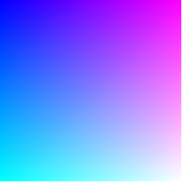

# stumpy_png
[](https://travis-ci.org/stumpycr/stumpy_png)

[Documentation](https://docs.leonrische.me/stumpy_png/)

## Interface

* `StumpyPNG.read(path : String) : Canvas` read a PNG image file from a path
* `StumpyPNG.read(io : IO) : Canvas` read a PNG image file from any IO object
* `StumpyPNG.write(canvas, path : String, bit_depth: 16, color_type: :rgb_alpha)` save a canvas as a PNG image file
* `StumpyPNG.write(canvas, io : IO, bit_depth: 16, color_type: :rgb_alpha)` write a canvas as PNG data to any IO object
  * `bit_depth` is optional, valid values are `8` and `16`(default)
  * `color_type` is optional, valid values are `:grayscale`, `:grayscale_alpha`, `:rgb` and `:rgb_alpha`(default)
* `StumpyPNG::PNG`, helper class to store some state while parsing PNG files
* `Canvas` and `RGBA` from [stumpy_core](https://github.com/stumpycr/stumpy_core)

## Usage

### Install the `stumpy_png` shard

1. `shards init`
2. Add the dependency to the `shard.yml` file
 ``` yaml
 ...
 dependencies:
   stumpy_png:
     github: stumpycr/stumpy_png
     version: "~> 5.0"
 ...
 ```
3. `shards install`

### Reading

``` crystal
require "stumpy_png"

canvas = StumpyPNG.read("foo.png")
r, g, b = canvas[0, 0].to_rgb8
puts "red=#{r}, green=#{g}, blue=#{b}"
```

### Writing

``` crystal
require "stumpy_png"
include StumpyPNG

canvas = Canvas.new(256, 256)

(0..255).each do |x|
  (0..255).each do |y|
    # RGBA.from_rgb_n(values, bit_depth) is an internal helper method
    # that creates an RGBA object from a rgb triplet with a given bit depth
    color = RGBA.from_rgb_n(x, y, 255, 8)
    canvas[x, y] = color
  end
end

StumpyPNG.write(canvas, "rainbow.png")
```



(See `examples/` for more examples)

## Reading PNG files

### Color Types

- [x] Grayscale
- [x] Grayscale + Alpha
- [x] RGB
- [x] RGB + Alpha
- [x] Palette

### Filter Types

- [x] None
- [x] Sub
- [x] Up
- [x] Average
- [x] Paeth

### Interlacing Methods

- [x] None
- [x] Adam7

### Ancillary Chunks

None are supported right now.

## Writing

* RGB with 8 or 16 bits
* RGB + Alpha with 8 or 16 bits
* Grayscale with 8 or 16 bits
* Grayscale + Alpha with 8 or 16 bits

## Troubleshooting

If you run into errors like

```bash
/usr/bin/ld: cannot find -lz
collect2: error: ld returned 1 exit status
```

make sure `zlib` is installed
([Installing zlib under ubuntu](https://ubuntuforums.org/showthread.php?t=1528204)).

## Contributors

Thanks goes to these wonderful people ([emoji key](https://github.com/kentcdodds/all-contributors#emoji-key)):

<!-- ALL-CONTRIBUTORS-LIST:START - Do not remove or modify this section -->
<!-- prettier-ignore -->
| [<br /><sub><b>Chris Hobbs</b></sub>](https://github.com/rx14)<br />[💻](https://github.com/l3kn/stumpy_png/commits?author=RX14 "Code") | [<br /><sub><b>Ary Borenszweig</b></sub>](https://github.com/asterite)<br />[💻](https://github.com/l3kn/stumpy_png/commits?author=asterite "Code") | [<br /><sub><b>Alex Muscar</b></sub>](https://github.com/muscar)<br />[💻](https://github.com/l3kn/stumpy_png/commits?author=muscar "Code") | [<br /><sub><b>Dru Jensen</b></sub>](https://github.com/drujensen)<br />[💻](https://github.com/l3kn/stumpy_png/commits?author=drujensen "Code") | [<br /><sub><b>kojix2</b></sub>](https://github.com/kojix2)<br />[📖](https://github.com/l3kn/stumpy_png/commits?author=kojix2 "Documentation") | [<br /><sub><b>obskyr</b></sub>](http://obskyr.io/)<br />[💻](https://github.com/l3kn/stumpy_png/commits?author=obskyr "Code") | [<br /><sub><b>r00ster</b></sub>](https://github.com/r00ster91)<br />[💻](https://github.com/l3kn/stumpy_png/commits?author=r00ster91 "Code") |
| :---: | :---: | :---: | :---: | :---: | :---: | :---: |
<!-- ALL-CONTRIBUTORS-LIST:END -->

This project follows the [all-contributors](https://github.com/kentcdodds/all-contributors) specification. Contributions of any kind welcome!
